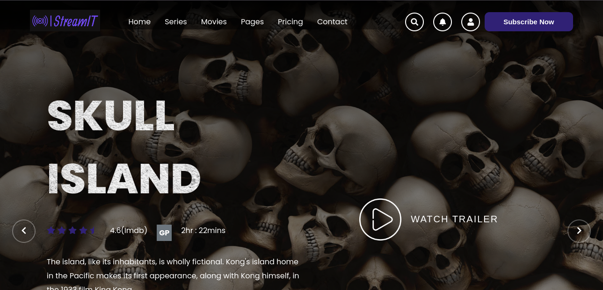

# Project Title :

StreamIT: Your Personal Movie Streaming Guide

# Description :

StreamIT is a user-friendly web application designed for movie enthusiasts who love to explore and keep track of their favorite films. Built with React and styled using CSS, this app utilizes React Router for seamless navigation across different components. StreamIT provides a rich browsing experience with a simplistic yet efficient local file-based database to store and retrieve movie data.

# Key Features  :

Movie Exploration: Dive into a vast collection of movie genres and titles, all available at your fingertips.
Interactive UI: A clean and responsive user interface that ensures a smooth navigation experience across the app.
Local Movie Data Storage: Utilizes local files for storing movie data, ensuring quick access and reliability without the need for external database dependencies.
Favorites and Watchlist: Users can easily mark movies as favorites and add them to their watchlist for future viewing.

# Technologies Used :

- React.js: For building a dynamic and responsive front-end.
- CSS: For custom styling and responsive design.
- React Router DOM: Used for handling routing and navigation within the application.

## Application Screenshots

---

---

